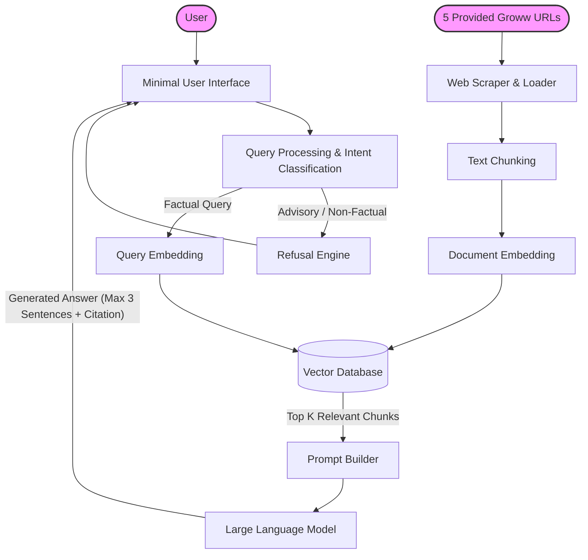
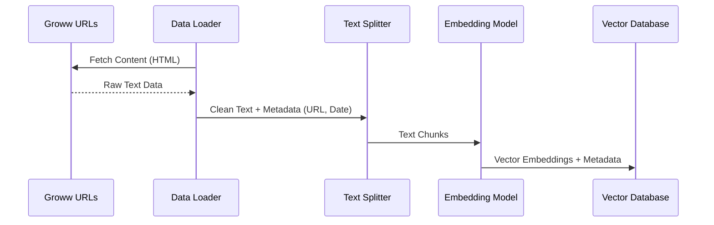
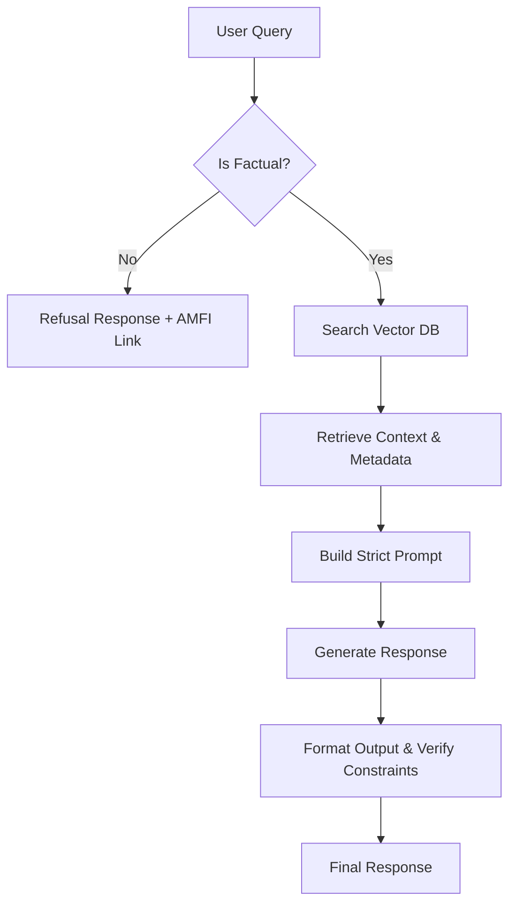

# Architecture Document: Mutual Fund FAQ Assistant

## 1. System Overview
The Mutual Fund FAQ Assistant uses a **Retrieval-Augmented Generation (RAG)** architecture. The system is designed to retrieve verified, factual information exclusively from the 5 pre-defined Groww URLs and generate concise, source-backed answers while strictly blocking any advisory or non-factual queries.

### High-Level Architecture Diagram

## 2. Core Components

### A. Data Ingestion & Processing (Offline Pipeline)
This pipeline is responsible for building the knowledge base from the defined corpus.

- **Sources:** The 5 specified Groww URLs for the Aditya Birla Sun Life schemes.
- **Document Loaders:** Extracts clean text from the provided HTML URLs (no PDFs or other sources).
- **Text Chunking:** Splits the content into smaller, semantically meaningful chunks (e.g., using recursive character text splitters) to ensure the vector search retrieves precise facts.
- **Embedding Model:** Converts text chunks into dense vector representations.
- **Vector Database:** Stores the embeddings along with their metadata (Source URL, Last Updated Date) for fast similarity search.

### B. Query Processing & Refusal Engine
Strict adherence to the "facts-only" constraint is enforced here before any context is retrieved.

- **Intent Classification:** Before retrieval, the query is analyzed. If it asks for opinions, comparisons (e.g., "Which is better?"), or investment advice (e.g., "Should I invest?"), the request is routed to the Refusal Engine.
- **Refusal Engine:** Returns a polite, predefined response refusing the advice and providing an educational AMFI/SEBI link.

### C. Retrieval & Generation (Online Pipeline)
For factual queries, the RAG pipeline is executed.

- **Query Embedding:** The user's query is converted into a vector representation.
- **Semantic Search:** The Vector DB retrieves the top-K most relevant document chunks based on cosine similarity.
- **Prompt Construction:** The retrieved chunks and their metadata are injected into a strict prompt template. 
- **LLM Generation:** The LLM generates a response adhering to the formatting rules:
  1. Maximum 3 sentences.
  2. Exactly one citation link.
  3. Appends the footer: *"Last updated from sources: <date>"*

### D. Minimal User Interface
The frontend is a lightweight, clean web interface designed for transparency and ease of use.
- **Components:** Welcome message, 3 clickable example queries, chat interface.
- **Disclaimer Banner:** A permanent, highly visible footer/header stating: **"Facts-only. No investment advice."**
- **Zero PII Policy:** The UI does not request or store any Personal Identifiable Information (no logins, no account numbers).

## 3. Technology Stack Recommendations
While the implementation can vary, the following stack is recommended for a lightweight, robust system:
- **Frontend:** React, Next.js, or basic HTML/JS/CSS (Tailwind).
- **Backend/API:** FastAPI (Python) or Express (Node.js).
- **LLM / Embeddings:** Groq for generation and BGE (BAAI General Embedding) for embeddings.
- **Vector Database:** ChromaDB, Pinecone, or Qdrant.
- **Orchestration:** LangChain or LlamaIndex.
